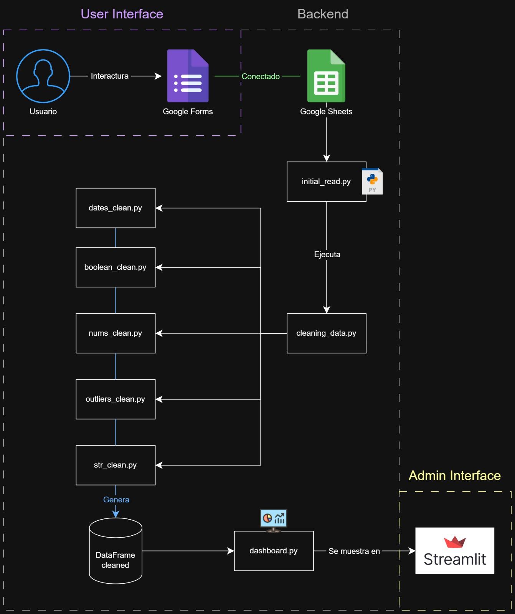
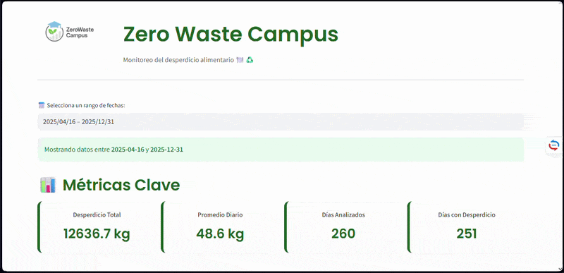

# ZeroWaste Campus 🍽️📊

**Datos que alimentan el cambio**

[](https://python.org)
[](https://streamlit.io)
[](LICENSE)

Plataforma digital orientada a la gestión y análisis del desperdicio alimentario en entornos educativos. Combina lectura y limpieza de datos, simulación estadística y visualización mediante reportes automáticos para fomentar la toma de decisiones sostenibles.

---

## 🎯 Propósito

El desperdicio de alimentos en comedores escolares y universitarios es una problemática persistente y poco cuantificada. La falta de datos confiables y herramientas accesibles dificulta su mitigación.

**ZeroWaste Campus** busca:
- Medir y visualizar patrones de desperdicio alimentario.
- Promover la conciencia ambiental en la comunidad educativa.
- Facilitar la toma de decisiones basada en datos.

---

## 🧠 Estado del proyecto

✅ **Prototipo funcional (MVP)** – TRL 4–6  

- Desarrollo técnico completo y operativo.  
- Uso de datos simulados para validación.  
- Flujo de datos, procesamiento y visualización verificados.  

---

## 🛠️ Tecnologías utilizadas

| Herramienta | Propósito |
|------------|----------|
| **Python** | Lenguaje principal |
| **Streamlit** | Interfaz de usuario |
| **Pandas** | Procesamiento y análisis de datos |
| **Plotly** | Visualización interactiva |
| **gspread + oauth2client** | Integración con Google Sheets |
| **unidecode** | Normalización de texto |
| **re** | Validación y limpieza de cadenas |
| **os** | Manejo de archivos |

---

## 🧱 Arquitectura del sistema

El sistema sigue un flujo estructurado de procesamiento de datos, desde la captura hasta la visualización:

- **Captura de datos:** mediante formularios digitales (Google Forms).
- **Almacenamiento:** los datos se registran automáticamente en Google Sheets.
- **Lectura inicial:** se realiza mediante scripts en Python (`initial_read.py`).
- **Limpieza de datos:** proceso modular dividido en:
  - `dates_clean.py`
  - `boolean_clean.py`
  - `nums_clean.py`
  - `outliers_clean.py`
  - `str_clean.py`
- **Procesamiento:** consolidación en un dataset limpio.
- **Visualización:** dashboard interactivo desarrollado en Streamlit (`dashboard.py`).

> Nota: El diagrama representa el flujo lógico del sistema dentro del prototipo desarrollado.



---

## 📹 Demostración

A continuación se muestra un ejemplo interactivo del funcionamiento de la aplicación:



---

## 🚀 Cómo ejecutar el proyecto

1. **Clonar el repositorio**
```bash
git clone https://github.com/tu-usuario/ZeroWaste-Campus.git
cd ZeroWaste-Campus
```

2. **Crear entorno virtual (opcional)**
```bash
python -m venv venv
source venv/bin/activate   # Linux/macOS
venv\Scripts\activate      # Windows
```

3. **Instalar dependencias**
```bash
pip install -r requirements.txt
```

4. **Configurar credenciales de Google Sheets**
- Ubica el archivo `creds.json` en la raíz del proyecto.
- Comparte la hoja de cálculo con el `client_email` de la cuenta de servicio.
- Habilita la API de Google Sheets en Google Cloud.

5. **Ejecutar la aplicación**
```bash
streamlit run app.py
```

---

## ⚠️ Limitaciones del proyecto

Este proyecto se desarrolló como un **prototipo funcional (MVP)** en un contexto académico.

- Los datos utilizados son **simulados**, debido a la falta de acceso a fuentes reales.
- No se realizó validación en un entorno operativo (comedores reales).
- El enfoque principal fue validar el flujo técnico: ingesta, procesamiento y visualización de datos.

A pesar de estas limitaciones, el sistema demuestra la viabilidad de implementar soluciones de analítica de datos para la gestión del desperdicio alimentario en entornos educativos.

---

## 📚 Referentes

- EatCloud – Economía circular aplicada a alimentos.
- Winnow Solutions – Reducción de desperdicio con analítica.
- FoodWise – Visualización y gamificación en entornos educativos.

---

## 📄 Licencia

Distribuido bajo licencia MIT. Ver archivo `LICENSE` para más información.

---

**ZeroWaste Campus** – *Datos que alimentan el cambio*  
Desarrollado por Michael Yesid Baquero Gómez, Angie Paola Montero Tique y Elquin Retavisca Linares\
Fundación Universitaria Cafam  
Bogotá, Colombia – 2025
