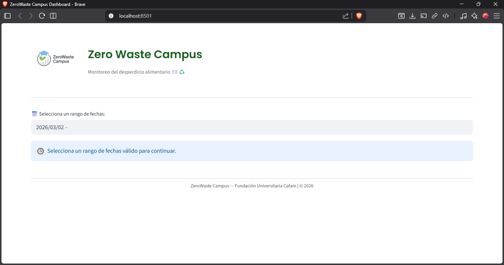
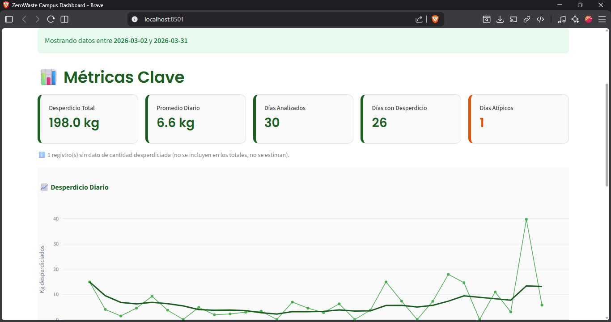
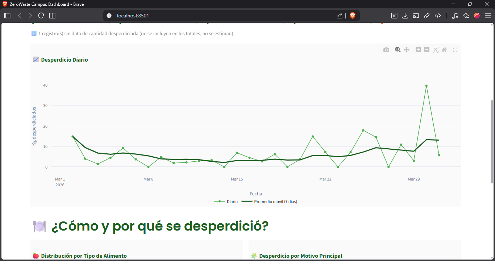
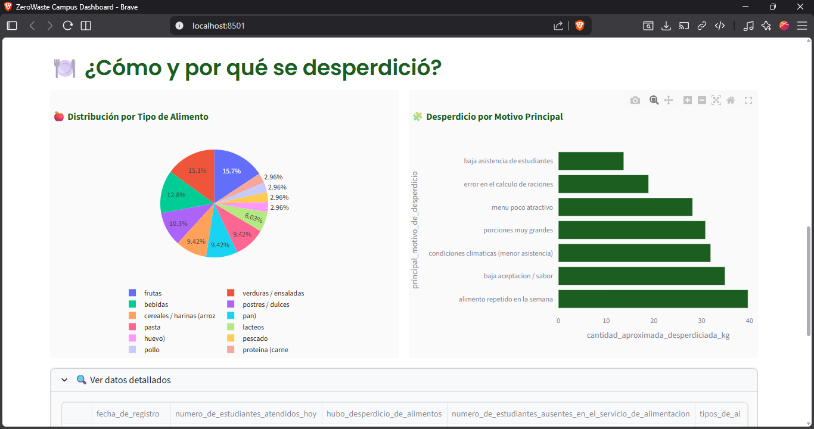
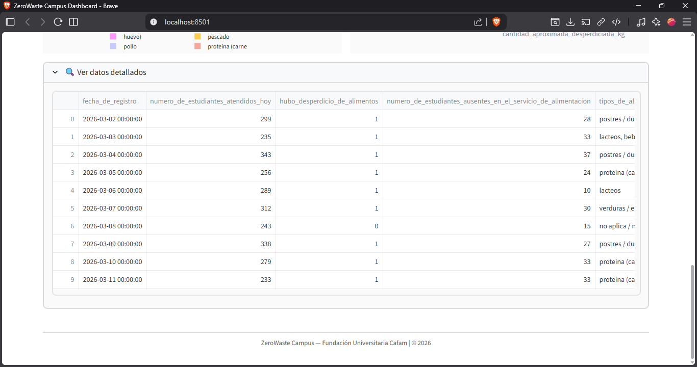
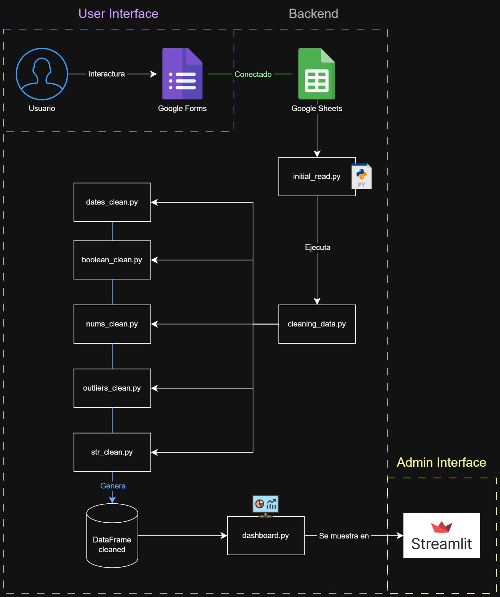

# ZeroWaste Campus 🍽️📊

**Datos que alimentan el cambio**

[](https://python.org)
[](https://streamlit.io)
[](https://github.com/MichaelBaquero/ZeroWaste_Campus/blob/main/LICENSE.TXT)

Plataforma digital orientada a la gestión y análisis del desperdicio alimentario en entornos educativos. Combina lectura y limpieza de datos, simulación estadística y un dashboard interactivo en Streamlit para fomentar la toma de decisiones sostenibles.

---

## 🎯 Propósito

El desperdicio de alimentos en comedores escolares y universitarios es una problemática persistente y poco cuantificada. La falta de datos confiables y herramientas accesibles dificulta su mitigación.

**ZeroWaste Campus** busca:

- Medir y visualizar patrones de desperdicio alimentario.
- Promover la conciencia ambiental en la comunidad educativa.
- Facilitar la toma de decisiones basada en datos.

---

## 🚀 Características principales

- **Filtro por rango de fechas** con validación en tiempo real — el dashboard solo procesa y muestra resultados cuando el rango seleccionado es válido.
- **KPIs dinámicos** que se recalculan automáticamente según el rango elegido: desperdicio total, promedio diario, días analizados, días con desperdicio y días atípicos.
- **Gráficos interactivos con Plotly**:
  * Serie de tiempo del desperdicio diario con promedio móvil de 7 días.
  * Distribución del desperdicio por tipo de alimento (frutas, verduras, proteína, lácteos, etc.).
  * Desperdicio por motivo principal (baja asistencia, error en cálculo de raciones, menú poco atractivo, entre otros).
- **Tabla de datos depurada** con el detalle diario: estudiantes atendidos, ausencias, tipos de alimento desperdiciado y más.
- **Manejo de datos incompletos**: los registros sin cantidad desperdiciada se señalan y se excluyen de los totales en lugar de estimarse.

---

## 📸 Capturas de pantalla

**Inicio y selección de rango de fechas**


**Métricas clave (KPIs)**


**Desperdicio diario con promedio móvil**


**Distribución por tipo de alimento y motivo de desperdicio**


**Tabla de datos detallados**


---

## 🧠 Estado del proyecto

🔒 **Proyecto cerrado** — desarrollo finalizado, sin nuevas funcionalidades planeadas.

- Prototipo funcional (MVP) – TRL 4–6.
- Desarrollo técnico completo y operativo.
- Uso de datos simulados para validación.
- Flujo de datos, procesamiento y visualización verificados.

---

## 🛠️ Tecnologías utilizadas

| Herramienta                | Propósito                         |
| --------------------------- | ---------------------------------- |
| **Python**                  | Lenguaje principal                 |
| **Streamlit**                | Interfaz de usuario                |
| **Pandas**                   | Procesamiento y análisis de datos  |
| **Plotly**                   | Visualización interactiva          |
| **gspread + oauth2client**   | Integración con Google Sheets      |
| **unidecode**                | Normalización de texto             |
| **re**                       | Validación y limpieza de cadenas   |
| **os**                       | Manejo de archivos                 |

---

## 🧱 Arquitectura del sistema

El sistema sigue un flujo estructurado de procesamiento de datos, desde la captura hasta la visualización:

- **Captura de datos:** mediante formularios digitales (Google Forms).
- **Almacenamiento:** los datos se registran automáticamente en Google Sheets.
- **Lectura inicial:** se realiza mediante scripts en Python (`Backend/initial_read.py`).
- **Limpieza de datos:** proceso modular en `Backend/`:
  - `cleaning_data.py` – orquestación general de la limpieza
  - `numeric_clean.py` – limpieza de valores numéricos
  - `str_clean.py` – normalización de cadenas de texto
  - `tipos_basicos_clean.py` – normalización de fechas y booleanos
- **Procesamiento:** consolidación en un dataset limpio.
- **Visualización:** dashboard interactivo desarrollado en Streamlit (`Frontend/`), con filtro de fechas, KPIs dinámicos y gráficos Plotly.

> Nota: El diagrama representa el flujo lógico del sistema dentro del prototipo desarrollado.



---

## 🗂️ Estructura del proyecto

```
ZeroWaste-Campus/
├── app.py                          # Punto de entrada principal (Streamlit)
├── config.py                       # Configuración general del proyecto
├── requirements.txt                # Dependencias de Python
├── LICENSE.TXT
├── .streamlit/
│   └── config.toml                 # Configuración de Streamlit
├── Backend/                        # Lógica de negocio y procesamiento de datos
│   ├── __init__.py
│   ├── initial_read.py             # Lectura desde Google Sheets
│   ├── cleaning_data.py            # Orquestación de la limpieza de datos
│   ├── numeric_clean.py            # Limpieza de valores numéricos
│   ├── str_clean.py                # Normalización de cadenas de texto
│   ├── tipos_basicos_clean.py      # Normalización de fechas y booleanos
│   └── creds.json                  # Credenciales de Google Sheets (no versionado)
├── Frontend/                       # Interfaz del dashboard (Streamlit)
├── Documentacion/                  # Documentación del proyecto
│   ├── 01_ESTRUCTURA_GOOGLE_FORM.md
│   ├── 02_SETUP.md
│   └── docs/
│       ├── arquitectura.png        # Diagrama de arquitectura del sistema
│       └── screenshots/            # Capturas del dashboard
└── .gitignore
```

---

## 📦 Instalación y ejecución local

### Requisitos previos

- Python 3.9 o superior
- Cuenta de servicio de Google Cloud con acceso a Google Sheets

### Pasos

1. Clona el repositorio:

```
git clone https://github.com/MichaelBaquero/ZeroWaste_Campus.git
cd ZeroWaste_Campus
```

2. Crea y activa un entorno virtual (opcional):

```
python -m venv venv
source venv/bin/activate   # Linux/macOS
venv\Scripts\activate      # Windows
```

3. Instala las dependencias:

```
pip install -r requirements.txt
```

4. Configura las credenciales de Google Sheets:
   - Ubica el archivo `creds.json` en `Backend/`.
   - Comparte la hoja de cálculo con el `client_email` de la cuenta de servicio.
   - Habilita la API de Google Sheets en Google Cloud.

5. Ejecuta la aplicación:

```
streamlit run app.py
```

---

## ⚠️ Limitaciones conocidas

Este proyecto se desarrolló como un **prototipo funcional (MVP)** en un contexto académico.

- Los datos utilizados son **simulados**, debido a la falta de acceso a fuentes reales.
- No se realizó validación en un entorno operativo (comedores reales).
- El enfoque principal fue validar el flujo técnico: ingesta, procesamiento y visualización de datos.

A pesar de estas limitaciones, el sistema demuestra la viabilidad de implementar soluciones de analítica de datos para la gestión del desperdicio alimentario en entornos educativos.

---

## 📚 Referentes

- EatCloud – Economía circular aplicada a alimentos.
- Winnow Solutions – Reducción de desperdicio con analítica.
- FoodWise – Visualización y gamificación en entornos educativos.

---

## 📄 Licencia

Distribuido bajo licencia MIT. Ver archivo `LICENSE.TXT` para más información.

---

**ZeroWaste Campus** – *Datos que alimentan el cambio*
Desarrollado por Michael Yesid Baquero Gómez, Angie Paola Montero Tique y Elquin Retavisca Linares
Fundación Universitaria Cafam
Bogotá, Colombia – 2026